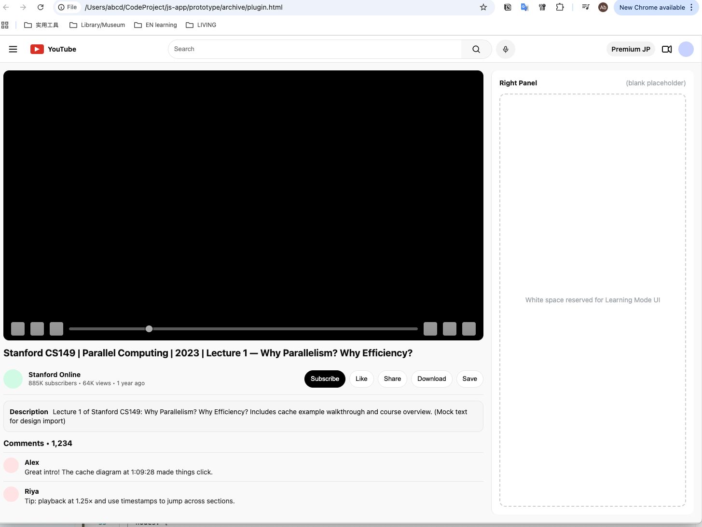

- [How to build Chrome extension](https://www.youtube.com/watch?v=0n809nd4Zu4)
- [White board](https://reactflow.dev)

## 🎯 Project Concept

### Title: YouTube Learning Mode (Chrome Plugin + Web Dashboard)

Purpose: Transform YouTube from a chaotic video platform into a structured learning environment.

### Core Idea:

While YouTube hosts vast educational resources, learners lack a systematic way to discover, organize, and revisit learning materials aligned with their personal goals.

#### This prototype aims to enhance UX inside YouTube, helping users:

- Discover content relevant to their skill level and goal.

- Visualize their learning progress and roadmap.

- Interact with YouTube resources more efficiently.

## 🧭 Design Goals

- Focus on frontend UI/UX mockups (not backend or data systems).

- Use mock data for interface interactions.

- Keep the tool clean, visual, and low-friction for quick comprehension.

- Present knowledge visually (e.g., trie or graph-like structures) instead of nested playlists.

- Design for Google ecosystem learners — easy integration with Docs, Drive, and NotebookLM.

### 🧠 Core UX Concept

- “Visualize Learning, Don’t List It.”
  A lean trie-based knowledge map that lets users expand, prune, and connect topics visually — minimizing clicks, maximizing clarity.

#### Key Mechanisms:

- Visual trie = topic tree (expandable, hierarchical, minimal).

- Embedded video preview (hover-based summary).

- Automatic context memory (“why you added this video”).

- Drag-reorder nodes, mark completion, resume later.

## Summary

This is a visual knowledge interface for structured self-learning. Focus on:

- Build clean mockups with fake data.

- Test user flows inside the YouTube frame (search → watch → reflect).

- Use the right panel (blank for now) as a container for the Learning Mode UI.
  
